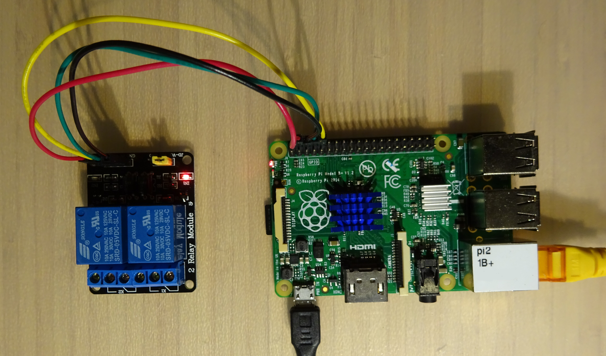

# rpi-gpio-api
Small Flask API to toggle Rapsberry Pi GPIOs




## Who

This code is written by **kobbejager**, but is based on bits and pieces taken from various sources. As such, I don't take any credit in this, nor do I give any guarantees.

This code is licenced with the **UNLICENCE**. See the *LICENSE* file for more documentation.

## Prerequisites

Python 3
Packages: 
- Flask, 
- Flask-API 
- uwsgi

```
sudo pip3 install Flask Flask-API uwsgi
```

## Installation

### Installation of the Flask application:

```
cd /opt
sudo git clone https://github.com/kobbejager/rpi-gpio-api
```

### Configuration

In **app.py** you can add, change and name swithable GPIO pins.
The example below defines two switches (or relays in this case): the first relay is named "badkamer", and is operated by pin 8 on the Raspberry Pi. 

```
relays = {"badkamer": 8, "slaapkamer": 10}
```

Note that physical pin numbers are used, not the BCM numbering. If you want to change this, replace `GPIO.setmode(GPIO.BOARD)` by `GPIO.setmode(GPIO.BCM)`

### Installing, starting and enabling the Systemd unit

```
sudo cp rpi-gpio-api/rpi-gpio-api.service /etc/systemd/system
sudo systemctl daemon-reload
sudo systemctl start rpi-gpio-api
sudo systemctl enable rpi-gpio-api
```

## Usage

When the API is running, it should be accessible on port 5000.

To see the current state of the relay "badkamer": send a GET-request to e.g. `http://[IP-of-RPI]:5000/badkamer/`

To switch off the relay "badkamer", there are multiple methods
- POST to `http://[IP-of-RPI]:5000/badkamer/` with `Content-Type: multipart/form-data` and payload `state=0`
- POST to `http://[IP-of-RPI]:5000/badkamer/` with `Content-Type: Content-Type: application/json` and payload `{"state"=0}`
- GET to `http://[IP-of-RPI]:5000/badkamer/0` or `http://[IP-of-RPI]:5000/badkamer/off`

To switch on the relay "badkamer", the same approach can be used
- POST to `http://[IP-of-RPI]:5000/badkamer/` with `Content-Type: multipart/form-data` and payload `state=1`
- POST to `http://[IP-of-RPI]:5000/badkamer/` with `Content-Type: Content-Type: application/json` and payload `{"state"=1}`
- GET to `http://[IP-of-RPI]:5000/badkamer/1` or `http://[IP-of-RPI]:5000/badkamer/on`

To toggle the relay "badkamer":
- GET to `http://[IP-of-RPI]:5000/badkamer/toggle`

